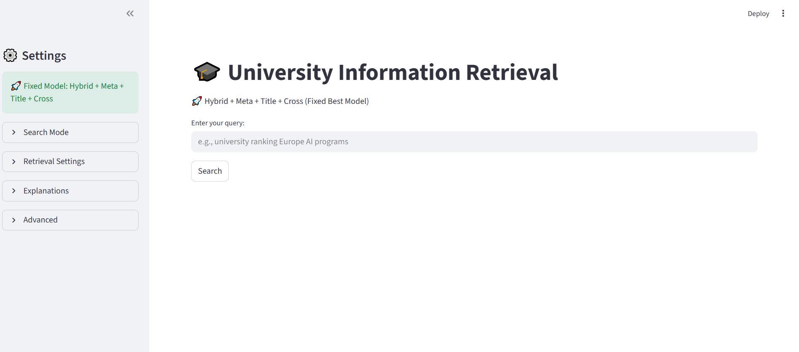
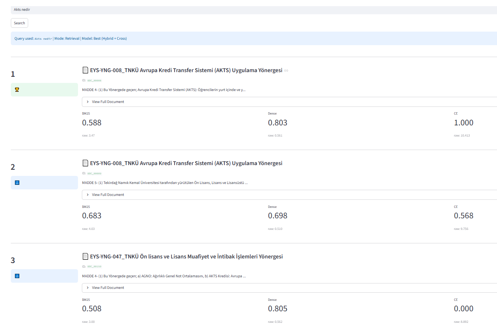
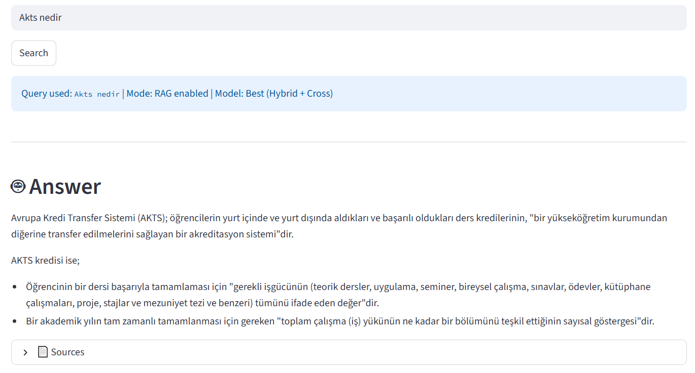

<div align="center">

# 🎓 University Information Retrieval System

**An end-to-end Turkish-language IR system for university regulation documents.**  
Hybrid BM25 + Dense + Elasticsearch retrieval · Cross-encoder reranking · PRF · RAG · Explainability

[](https://python.org)
[](https://streamlit.io)
[](https://github.com/facebookresearch/faiss)
[](LICENSE)

</div>

---

## 📸 Demo

### Main Interface
> Clean query interface with a collapsible settings sidebar. The active model (`Hybrid + Meta + Title + Cross`) is always surfaced in the sidebar header so users immediately know what configuration is running.



---

### Retrieval Mode — Ranked Results with Score Breakdown
> Query `"Akts nedir"` returns ranked regulation articles from TNKÜ's official documents. Each result shows the regulation title, document ID, a text preview, and a **three-column score panel** — normalized BM25, Dense cosine similarity, and Cross-Encoder score (with raw values beneath). Rank 1 receives a trophy badge; ranks 2–3 receive a top-3 indicator.



---

### RAG Mode — Grounded Answer Generation
> The same query with RAG enabled. Instead of a ranked list, the system generates a structured, citation-grounded answer via **Gemini** using the top-k retrieved documents as context. The answer explains AKTS (European Credit Transfer System) with bullet-point definitions pulled directly from the regulation text. Source documents remain accessible in a collapsible panel below.



---

## Overview

This project builds a complete IR pipeline for Turkish university regulation documents — from raw PDF ingestion to a production-ready search interface. The system was developed and evaluated as part of a university Information Retrieval and Web Search course, with a full experimental study comparing 20+ retrieval configurations.

Key design goals:
- **Domain specificity**: Turkish morphological analysis, domain stopwords, and regulation-aware query expansion dictionaries
- **Rigorous evaluation**: MRR@k, Recall@k, nDCG@k with latency tracking across a full ablation study
- **Interpretability**: Integrated Gradients explanations with faithfulness/sufficiency/consistency metrics
- **Practical interface**: A Streamlit app covering retrieval, RAG, model comparison, query reformulation suggestions, and annotation

---

## Architecture

```
                         ┌─────────────────────────────┐
                         │         Query Input          │
                         └──────────────┬──────────────┘
                                        │
                         ┌──────────────▼──────────────┐
                         │   Turkish Preprocessing      │
                         │  (Zemberek lemmatization,    │
                         │   stopword removal, NFKC)    │
                         └──────────────┬──────────────┘
                                        │
                         ┌──────────────▼──────────────┐
                         │     Query Classification     │
                         │  date_query │ legal_query    │
                         │  short_query│ informational  │
                         │  process_query │ default     │
                         └──────────────┬──────────────┘
                                        │
                         ┌──────────────▼──────────────┐
                         │   Weighted Query Expansion   │
                         │  synonym · hint · concept    │
                         │      · hierarchical          │
                         └──────┬───────────────┬───────┘
                                │               │
               ┌────────────────▼──┐     ┌──────▼────────────────┐
               │   Sparse (BM25)   │     │  Dense (FAISS + ST)   │
               │  weighted terms   │     │  Inner product search  │
               └────────────┬──────┘     └──────┬────────────────┘
                            │                   │
               ┌────────────▼──────────────────▼───────────────┐
               │              Hybrid Score Fusion               │
               │   query-type-aware weights (w_bm25, w_dense,  │
               │   w_elastic) + title boost + meta boost        │
               │   + length normalization                       │
               └────────────────────┬───────────────────────────┘
                                    │
               ┌────────────────────▼───────────────────────────┐
               │        Pseudo-Relevance Feedback (PRF)          │
               │  top-5 docs → extract novel terms → re-score   │
               └────────────────────┬───────────────────────────┘
                                    │
               ┌────────────────────▼───────────────────────────┐
               │         Cross-Encoder Reranking (opt.)          │
               │  mmarco-mMiniLMv2-L12-H384-v1, fine-tuned      │
               │  with hard negatives · λ-CE fusion              │
               └────────────────────┬───────────────────────────┘
                                    │
                         ┌──────────▼──────────┐
                         │     Top-K Results    │
                         └──────────┬──────────┘
                                    │ (optional)
                         ┌──────────▼──────────┐
                         │   RAG via Gemini     │
                         │  grounded answer     │
                         └─────────────────────┘
```

---

## Features

### Retrieval Engine
| Feature | Detail |
|---|---|
| **Sparse retrieval** | BM25Okapi with weighted query expansion (original terms × 1.0, expanded terms × configurable weight) |
| **Dense retrieval** | SentenceTransformer embeddings indexed with FAISS (inner product, L2-normalized) |
| **Elasticsearch** | `multi_match` on `content^2`, `title^3`, `category`, `faculty` fields |
| **Score fusion** | Query-type-aware weight triplets `(w_bm25, w_dense, w_elastic)` normalized to sum to 1 |
| **Title boost** | Token overlap between query and document title, scaled by query length |
| **Meta boost** | Exact match against `article_no`, `paragraph_no`, `clause`, `category`, `faculty`, `degree_level` |
| **Length normalization** | Soft penalty: `score × (0.8 + 0.2 × min(doc_len / 200, 1))` |
| **PRF** | Top-5 initial results → extract top-5 novel terms (frequency > 1, length > 3) → reweight BM25 |

### Query Classification
Six rule-based classes dispatched before retrieval to tune alpha and expansion weights:

| Class | Trigger | Expansion Weight |
|---|---|---|
| `date_query` | 4-digit year in query | default |
| `legal_query` | `madde / fıkra / bent / article` | × 0.3 (reduced) |
| `short_query` | ≤ 2 tokens after preprocessing | × 0.7 |
| `informational` | `nasıl / nedir / ne / kaç / hangi` | × 1.1 |
| `process_query` | `başvuru / kayıt / mezuniyet / staj` | × 1.3 |
| `default` | all others | × 1.0 |

### Cross-Encoder Reranking
- Base model: `cross-encoder/mmarco-mMiniLMv2-L12-H384-v1` (multilingual)
- Fine-tuned with hard negatives mined from BM25 top-15
- Training data: positives from qrels + 3 hard negatives + 2 random negatives per query
- Final score: `λ_CE × CE_score + (1 − λ_CE) × hybrid_score`, where `λ_CE` varies by query type (0.3 for legal, 0.7 for informational, 0.5 otherwise)

### Turkish NLP
- **Morphological analysis**: Zemberek `TurkishMorphology` with conservative lemmatization — abbreviations (e.g. `AKTS`, `EYS`) and tokens where lemma shortens by more than 2 characters are preserved as-is
- **Stopwords**: General Turkish stopwords + domain-specific ones (`fıkra`, `bent`, `sayılı`, `tarihli`, `uyarınca`, ...)
- **Query expansion dictionaries**: synonyms, domain hints, legal/academic concepts, and hierarchical term relations — all hand-crafted for Turkish university regulation vocabulary

### Explainability
- Integrated Gradients (IG) for token-level attribution on top retrieved documents
- Three explanation quality metrics: **Faithfulness** (token impact on prediction), **Sufficiency** (key tokens alone explain relevance), **Consistency** (agreement across methods)
- IG heatmap rendered inline in the Streamlit app

### RAG Mode
- Builds context from top-k documents (up to 15,000 characters, ordered by rank)
- Sends to `gemini-3-flash-preview` with strict grounding instructions: no external knowledge, exact regulation terminology, `"Not found in documents"` when unanswerable
- Temperature: 0.2 for deterministic, formal answers
- Source documents available in collapsible expander below the answer

### Streamlit Application
- **Retrieval mode**: ranked results with BM25 / Dense / CE score breakdown per document
- **RAG mode**: structured grounded answer + collapsible sources
- **Model comparison mode**: side-by-side results from any two configurations with rank-diff analysis and overlap statistics
- **Query reformulation suggestions**: PRF + semantic expansion generates and scores candidate reformulated queries
- **Explanation panel**: per-result IG heatmap, key concept tags, and faithfulness/sufficiency/consistency metrics (togglable)
- **Settings sidebar**: collapsible panels for Search Mode, Retrieval Settings, Explanations, Advanced (model variants, compare mode)

---

## Experimental Results

### Ablation Study — MRR@5 (custom cross-encoder model, test set)

| # | Config | MRR@5 | Recall@5 | nDCG@5 | Avg Latency |
|---|---|---|---|---|---|
| 1 | **Hybrid + Meta + Title + Cross** | **0.630** | 0.135 | 0.492 | 8.07s |
| 2 | **Hybrid + Meta + Title + Expansion + Cross** | **0.630** | 0.142 | 0.505 | 9.70s |
| 3 | Hybrid + Title | 0.613 | 0.129 | 0.480 | 0.11s |
| 4 | Dense + Title | 0.613 | 0.129 | 0.480 | 0.07s |
| 5 | BM25 + Title | 0.590 | 0.130 | 0.466 | 0.003s |
| 6 | Hybrid + WeightedExpansion(0.5) | 0.600 | 0.130 | 0.479 | 0.16s |
| 7 | Hybrid | 0.515 | 0.111 | 0.405 | 0.09s |
| 8 | Dense | 0.515 | 0.111 | 0.405 | 0.07s |
| 9 | BM25 | 0.493 | 0.114 | 0.401 | 0.002s |

> **Key finding**: Cross-encoder reranking adds **+11.5 MRR points** over the base Hybrid. Title boosting is the single most impactful non-neural feature (+9.8 MRR over vanilla Hybrid). The best latency-quality tradeoff is `Hybrid+Title` at 0.11s / MRR 0.613.

### Success@1 — Fail Case Analysis

| Model | Success@1 | Rate |
|---|---|---|
| Hybrid + WeightedExpansion(0.5) | 38 / 40 | **95%** |
| Hybrid + Expansion + CE | 38 / 40 | **95%** |
| Custom Hybrid + WeightedExpansion(0.5) | 38 / 40 | **95%** |
| Dense | 37 / 40 | 92.5% |
| BM25 | 36 / 40 | 90.0% |

### Performance by Query Type (Hybrid model)

| Query Type | MRR | nDCG |
|---|---|---|
| `process_query` | 1.000 | 0.877 |
| `informational` | 0.962 | 0.900 |
| `default` | 0.933 | 0.805 |

---

## Project Structure

```
.
├── apps/
│   ├── annotation/
│   │   └── annotation_interface.py     # Streamlit qrel annotation tool
│   └── streamlit_app/
│       └── app.py                      # Main search UI
│
├── cli/
│   ├── build_data_pipeline.py          # PDF → corpus pipeline
│   ├── run_ablation.py                 # Ablation study runner
│   └── train_ir_pipeline.py            # End-to-end training
│
├── src/
│   ├── retrieval_pipeline.py           # UniversityIR — core retrieval class
│   ├── data_building/
│   │   ├── build_corpus.py             # PDF extraction, metadata tagging, preprocessing
│   │   ├── generate_query_pool.py      # Gold query pool generation
│   │   └── split_qrels.py              # Train/test qrel splitting
│   ├── processing/
│   │   ├── preprocessing.py            # Turkish tokenization & lemmatization
│   │   ├── query_expansion.py          # Weighted multi-dictionary expansion
│   │   └── query_expansion_stopwords.py # Synonyms, hints, concepts, hierarchical
│   ├── training/
│   │   ├── train_custom_cross_encoder.py # Cross-encoder fine-tuning with hard negatives
│   │   └── tuning.py                   # Hyperparameter search
│   ├── evaluation/
│   │   └── metrics.py                  # MRR, Recall@k, nDCG@k, latency
│   ├── explanations/
│   │   ├── explanation_engine.py       # Integrated Gradients engine
│   │   └── visualization.py            # IG heatmap rendering
│   └── utils/
│       ├── load_ir.py / save_ir.py     # Model serialization
│       └── qrels_utils.py              # Qrel loading & formatting
│
├── experiments/
│   ├── ablation/
│   │   ├── config.py                   # 20+ ablation configurations
│   │   └── runner.py                   # Parallel ablation executor
│   └── analysis/
│       ├── error_analysis.py
│       ├── fail_case_analysis.py
│       ├── final_analysis.py
│       ├── query_type_breakdown.py
│       └── statistical_significance.py
│
├── data (empty)/                       # Populate with your regulation PDFs
│   ├── raw/pdfs/
│   ├── interim/                        # corpus.json, metadata.csv
│   └── processed/                      # corpus_preprocessed.json, qrels/
│
├── models (empty)/
│   ├── ir_model/                       # Base model artifacts
│   └── ir_model_custom_ce/             # Model with domain-fine-tuned CE
│
└── outputs/
    ├── ablation_results/               # Per-config CSV results
    ├── runs/                           # Retrieved doc lists per config (JSON)
    └── analysis/                       # Error analysis, significance tests, figures
```

---

## Getting Started

### Prerequisites

- Python 3.9 – 3.11
- (Optional) Elasticsearch 8.x
- (Optional) Zemberek for Turkish morphological analysis (`pip install zemberek-python`)
- A Google AI API key for RAG mode

### Installation

```bash
git clone https://github.com/<your-username>/<repo-name>.git
cd <repo-name>
pip install -r requirements.txt
```

Core dependencies:

```
sentence-transformers   # dense embeddings + cross-encoder
faiss-cpu               # or faiss-gpu
rank-bm25
streamlit
pdfplumber
torch
numpy
pandas
elasticsearch           # optional
zemberek-python         # optional, recommended
google-genai            # for RAG mode
```

### Environment Variables

```bash
# Required for RAG mode — do NOT hardcode in source
export GOOGLE_API_KEY="your-key-here"
```

---

## Usage

### 1 — Build the corpus

Place regulation PDFs in `data/raw/pdfs/`, then run:

```bash
python cli/build_data_pipeline.py
```

Extracts text with `pdfplumber`, applies Turkish preprocessing, assigns structured metadata (category, faculty, degree level) from a regulation registry, and outputs `data/interim/corpus.json` and `data/processed/corpus_preprocessed.json`.

### 2 — Train the pipeline

```bash
python cli/train_ir_pipeline.py
```

Trains the SentenceTransformer dense model, builds the FAISS index, and fine-tunes the cross-encoder on hard negatives. Saves artifacts to `models/ir_model_custom_ce/`.

### 3 — Run the ablation study

```bash
python cli/run_ablation.py
```

Evaluates all 20+ configurations from `experiments/ablation/config.py` against the test qrels, writes per-config MRR / Recall / nDCG / latency to `outputs/ablation_results/`.

### 4 — Launch the search app

```bash
streamlit run apps/streamlit_app/app.py
```

### 5 — Launch the annotation tool

```bash
streamlit run apps/annotation/annotation_interface.py
```

---

## Evaluation

All metrics are implemented from scratch in `src/evaluation/metrics.py`:

```python
reciprocal_rank(retrieved, relevant)        # → MRR
recall_at_k(retrieved, relevant, k)         # → Recall@k  
ndcg_at_k(retrieved, relevant, k)           # → nDCG@k
run_ablation_evaluation(results, latency, qrels, k)   # → DataFrame
```

Latency is tracked per query (avg, P95, total) alongside retrieval quality, enabling explicit speed–quality tradeoff analysis across configurations.

---
## API Key Configuration

The application requires a Google API key to use the Gemini API.

Configure your API key through environment variables or Streamlit secrets before running the application:

```python
client = genai.Client(api_key=GOOGLE_API_KEY)
```

---

## Data

The `data/` directory is intentionally empty. Populate `data/raw/pdfs/` with Turkish university regulation documents. The build pipeline handles all extraction, structuring, and train/test splitting automatically.

---
